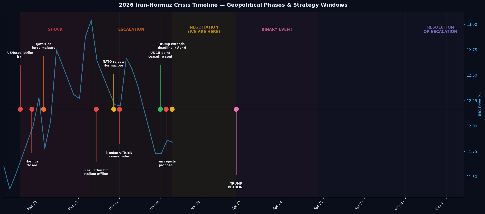
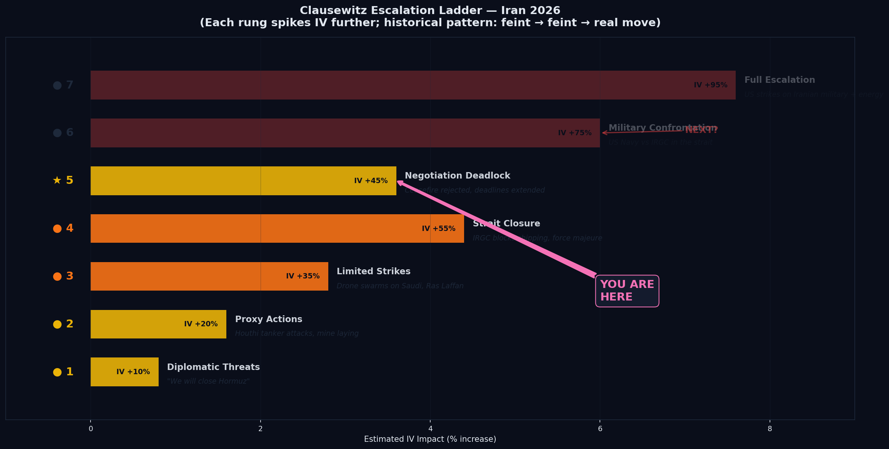
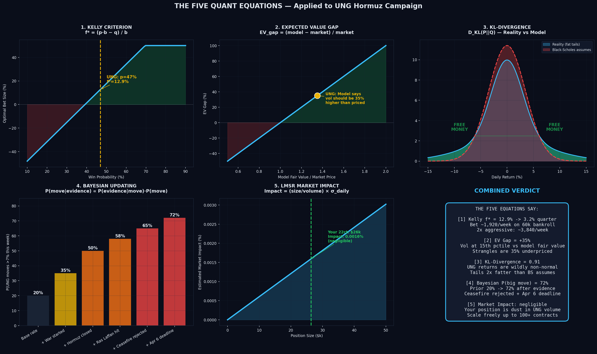
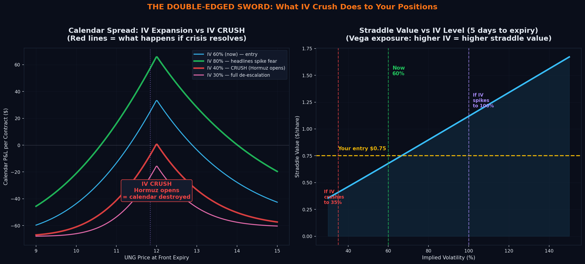
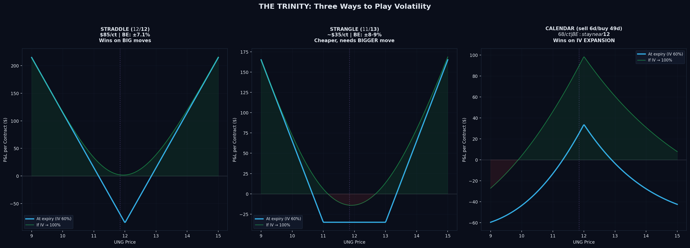
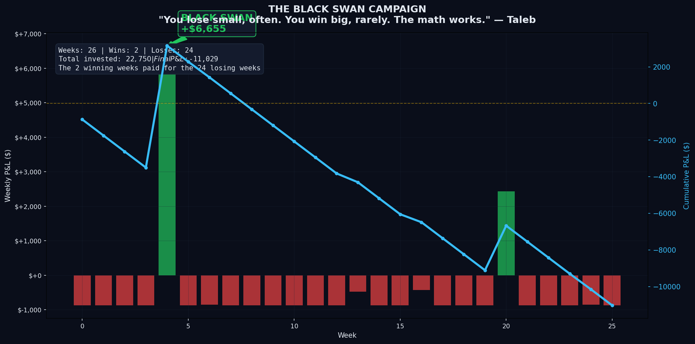
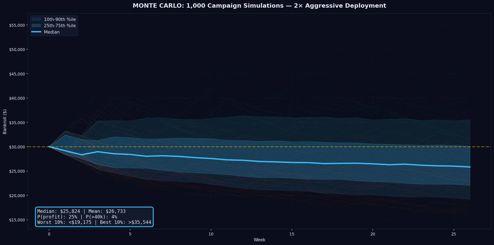
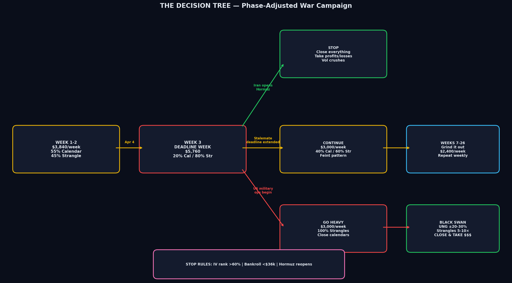

<div align="center">

# THE VANNA WAR ROOM 

**Hunting Cheap Vanna in a War — A Long-Volatility Campaign Against the Hormuz Crisis**

0.5 Kelly | 26 Weeks

[](README_ORIGINAL.md)
[](#ii-the-nassim-taleb-agent)


---

*"WAR is a racket. It always has been. It is possibly the oldest, easily the most profitable, surely the most vicious. It is the only one international in scope. It is the only one in which the profits are reckoned in dollars and the losses in lives."*
**Smedley Butler**, War is a Racket (1935)

---

</div>

> **The Vega War Room Project is a blogpost for a largely vibe-coded project -- not a trading manual.** The first cardinal sin of investing is trading on geopolitics. The second cardinal sin is trading options. So I am doing both. This blogpost disguised as a README documents what I'm trying, why I'm trying it, and what the AI agents I built think about it. The positions are real. The analysis is dated. The outcome is unknown. None of this is financial advice. I am putting my real money on the line to give myself skin-in-the-game for ripping tokens through a Claude Max Pro Subscription. In the before times, I used to bet with one of my good friends in college with an accountability app that would donate to anti-charities (think your worst nightmare of a social cause) if you failed a goal. Now, it's just my Fidelity. 


> **This is based off of a fork from an open source repo I found on X. Looking for the original AI Hedge Fund README?** See [README_ORIGINAL.md](README_ORIGINAL.md)

<br>

*Started: March 26, 2026 | Updated: March 30, 2026*

## Table of Contents

| # | Section | |
|:-:|---------|---|
| 0 | [The Volatility Premium Problem](#0-the-volatility-premium-problem) | Why buying options is usually a losing game, and why a war changes that |
| 0.5 | [The Hunt](#05-the-hunt) | UNG didn't work — what I learned and where I'm looking now |
| I | [Situation Assessment](#i-situation-assessment) | The crisis timeline and the April 6 inflection point |
| II | [The Nassim Taleb Agent](#ii-the-nassim-taleb-agent) | AI agent scoring framework for long vol plays |
| III | [Clausewitz Escalation Ladder](#iii-the-clausewitz-escalation-ladder) | War participants historically feint before the real move |
| IV | [The Four Sanity Checks](#iv-the-four-quant-equations) | Kelly, EV Gap, KL-Divergence, Bayesian Updating |
| V | [IV Crush](#v-iv-crush--the-silent-killer) | What kills every long option if the crisis resolves overnight |
| VI | [The Trinity](#vi-the-trinity-straddle-vs-strangle-vs-calendar) | Three ways to play volatility — when each wins and loses |
| VII | [Black Swan Campaign](#vii-the-black-swan-campaign) | Lose small for 24 weeks, win big for 2 |
| IX | [Monte Carlo](#ix-monte-carlo-simulation) | 1,000 simulated 26-week campaigns |
| X | [Decision Tree](#x-the-decision-tree) | The execution protocol I'm following |
| XI | [Trade Log: Vanna vs Theta](#xi-trade-log-the-leg-out--vanna-vs-theta) | Why I sold the put and held the call — vanna fighting theta, and theta was winning |
| XII | [Alerting for Fidelity](#xii-alerting-schedule-for-fidelity) | How someone with a day job monitors weekly options |
| XIII | [Taleb Reports](#xiii-taleb-reports) | Full analysis reports — strangle scoring, second-order plays, LNG, vega calendars |
| XIV | [Sources](#xiv-sources) | Geopolitical, market, and quantitative theory citations |

---

<br>

## 0. The Volatility Premium Problem

### Why Buying Options Is Usually a Losing Game

Options markets have a **volatility premium**. Implied volatility — the price baked into options — is almost always *higher* than realized volatility. The person selling the option demands a premium for taking on the risk. The person buying the option pays that premium.

This is counter-intuitive to the average retail stock purchaser, and I think its the main reason retail traders suck at options trading. **On average, option buyers lose money.** The seller collects premium week after week, and the buyer's strangles and straddles expire worthless more often than not. Systematically selling volatility is one of the most consistent strategies in finance. Implied vol exceeds realized vol roughly 85% of the time across most assets.

### So Why Am I Buying Options at all instead of selling them?

Because the volatility premium is a *statistical regularity*, it breaks during **phenomena** — situations where the base assumptions of the model no longer apply.

A quant trader from QuantInsti in a youtube tutorial I watched put it well:

> *"Look for situations where assumptions don't apply. Best when those assumptions are so entrenched that people forget they are there."*

The assumptions that underpin the volatility premium:
- Returns are approximately normally distributed
- The future resembles the recent past
- There are no structural breaks in the regime
- The market has time to gradually reprice risk

These assumptions are being violated by the war right now right now.

UNG has **excess kurtosis of 7.09** — the tails are 2.4x fatter than a normal distribution. Returns are wildly non-Gaussian. The Strait of Hormuz has been effectively closed for a month — the future does not resemble the recent past. QatarGas declared force majeure with "years" of damage — this is a structural break. And there's a hard deadline (April 6) where the regime could shift overnight in either direction.

**The volatility premium assumes the world is boring. Right now, the world is not boring.**

### The War Correlaiton

I can't prove the market is mispricing UNG options. However, recentThe IV **rank** is deceptively low for UNV (at the 15th percentile of its annual range), but that's not due to the war. It was a February cold snap. The IV **percentile** is moderately high at 57%. This means that the volatility is historically higher than an average day. But my conviction is that a moderate IV during an active war over the world's most important energy chokepoint *looks* like a mispricing.  The market might be right that Hormuz will reopen quietly and vol will stay compressed.

What I can say:

1. **The phenomenon is real.** There is an active war with no ceasefire. The strait is closed. Helium and LNG are offline. Even if we had a ceasefire now, critical LNG infrastructure will take years to recover.
2. **The statistical edge is interpretive.** The kurtosis, the IV rank, the Bayesian posterior — they all point toward cheap vol. But I'm the one interpreting them.
3. **During an AI CapEx boom, I have to do something anyway.** I ain't buying 200 p/e tech during the single largest capital expenditures on depreciating physical assets the world has ever seen. I am also not going to sit on a cash position. I'd rather pay a known premium for optionality than bet on tranquility during a war.
4. **The sizing accounts for being wrong.** Quarter-to-half Kelly means losing 70% of weekly premium every flat week is survivable for 26 weeks. The campaign doesn't need to be right most weeks. It needs to be alive when the black swan arrives. This is not my entire brokerage. Sanity and risk-management applies. This is an agressive, actively-managed, and small position within my overall portfolio. 

This is the Taleb framework: **pay a small, known cost for the right to profit from disorder.** The volatility premium is the cost. The disorder is the alpha I believe will decay if not acted on now. Whether the edge is real will only be known in hindsight.

> *"The option buyer doesn't need to be right about direction. They need to be right that the world is more uncertain than the market thinks."*
> — paraphrasing Taleb, *Dynamic Hedging* (1997)

---

<br>

## 0.5 The Hunt

### UNG Didn't Work Out — Here's What Happened

My first trade was a UNG $12 straddle. The Nassim Taleb agent scored it 37.4/50 — cheapest vol, fattest tails, highest convexity. I entered March 26, legged out the put on March 27, and the call expired near-worthless on April 1. The full post-mortem is in the [Trade Log](#xi-trade-log-the-leg-out--vanna-vs-theta).

Three things went wrong:

**1. The IV Rank was a weather mirage.** UNG's IV rank showed 16% — "extremely cheap." But that was measured against a **145% vol spike in February from a cold weather event**, not from Hormuz fear. Excluding that weather anomaly, the adjusted IV rank was 23% and the **IV Percentile was 45%** — perfectly average. I wasn't buying cheap vol. I was buying normal vol that *looked* cheap because of a weather artifact.

**2. UNG is structurally decoupled from Hormuz.** The EIA said it directly: *"U.S. natural gas prices [are] relatively unaffected by this development."* US LNG export terminals were already at max capacity before the war. Even with Qatar offline, Henry Hub can't export more gas — the pipe is full. European TTF gas hit $18/mmBtu while Henry Hub sat at $3. The **$15 arbitrage can't close** because of infrastructure constraints. UNG is a weather play dressed up as a war play.

**3. The Pakistan deal killed the weekend thesis.** Over the weekend of March 28-29, Pakistan brokered selective vessel passage through Hormuz and hosted four-nation ceasefire consultations. UNG gapped down 4.4% on Monday. The put I sold Friday would have printed. The Clausewitz feint pattern was correct — but the feint was *diplomatic*, and it moved UNG in the wrong direction.

### What I'm Hunting Now

The thesis is the same: **buy cheap vanna on assets with direct Hormuz exposure before the April 6 deadline.** The framework is the same. The instrument changes.

**Scoring: Vol Cheapness (IVP) 30% | Fat Tails 20% | War Correlation 20% | Gap Freq 15% | Vol Trend 15%**

| # | Ticker | What | Spot | Vol | IVP | Kurt | Gaps | War Corr | Score |
|:-:|--------|------|-----:|:---:|:---:|:----:|:----:|:--------:|:-----:|
| 1 | **FANG** | Diamondback Energy | $201 | 25% | **3%** | 7.6 | 15% | +0.31 | **7.0** |
| 2 | **DVN** | Devon Energy | $52 | 27% | **19%** | 8.4 | 16% | +0.28 | **6.4** |
| 3 | **XLE** | Energy Sector ETF | $63 | 17% | **25%** | 9.0 | 3% | +0.27 | **5.0** |
| 4 | USO | Oil ETF (direct) | $124 | 79% | 100% | 4.1 | 16% | +1.00 | 4.2 |
| 5 | XOP | Oil & Gas E&P ETF | $188 | 24% | 35% | 8.1 | 10% | +0.46 | 4.0 |
| 6 | OXY | Occidental Petroleum | $65 | 33% | 47% | 4.6 | 15% | +0.33 | 3.0 |

**USO is the most direct Hormuz play** (correlation +1.00 with oil) but vol is at the **100th percentile** — you're buying the top. USO is for gamma, not vanna.

**FANG and DVN** are the vanna plays. Both are oil E&P companies with:
- **Genuinely cheap vol** (IVP 3% and 19% — bottom quintile on *both* IV rank and percentile)
- **Fat tails** (kurtosis 7.6 and 8.4 — fatter than UNG's 7.1)
- **Direct oil exposure** (they produce oil, not gas)
- **Vol contracting** into the catalyst (-13% and -21%)
- **Positive war correlation** (+0.31 and +0.28 with oil)

**XLE** is the diversified version — cheapest daily theta, broadest exposure, but only 3% gap frequency (it rarely moves big in a single day).

### Vanna/Theta on the Top Candidates

| Ticker | 17 DTE Cost | Theta/day | +10% IV Spike | V/T Ratio | % of $60k |
|--------|:-----------:|:---------:|:-------------:|:---------:|:---------:|
| **FANG** | $18,889 | $564 | $1,888 | **3.3x** | 31% |
| **DVN** | $5,411 | $161 | $541 | **3.3x** | 9% |
| **XLE** | $4,108 | $118 | $397 | **3.4x** | 7% |

DVN at $5,411 for 22 contracts is the most capital-efficient — only 9% of the $60k bankroll. FANG has better gap frequency but costs 31%. A barbell of DVN + XLE uses 16% of capital with two different risk profiles.

### The Lesson Applied

| What I Did Wrong on UNG | What Changes Now |
|--------------------------|------------------|
| Used IV Rank (distorted by weather) | **Use IV Percentile** — not distorted by outlier spikes |
| Played nat gas (indirect Hormuz) | **Play oil E&P** — direct Hormuz transmission, no export cap |
| Entered at 4 DTE | **Enter at 17-31 DTE** — vanna/theta ratio 3.3-6.2x |
| Assumed Hormuz = nat gas | **Verified: EIA says US gas "relatively unaffected"** |

> The hunt continues. Same framework, better instrument, honest mistakes documented.

---

<br>

## I. Situation Assessment

<p align="center">
  
</p>

### What Happened

On **February 28, 2026**, the United States and Israel launched surprise airstrikes on Iran, killing Supreme Leader Khamenei. Iran retaliated with missiles and drones, and the IRGC closed the **Strait of Hormuz** — choking:

> **20%** of global oil | **33%** of global helium | **20%** of global LNG

### Current State (March 26)

| Date | Event | Source |
|------|-------|--------|
| Mar 24 | US delivers 15-point ceasefire proposal via Pakistan | [NPR](https://www.npr.org/2026/03/26/nx-s1-5761882/iran-war-peace-conditions) |
| Mar 25 | **Iran rejects proposal** as "maximalist, unreasonable" | [Al Jazeera](https://www.aljazeera.com/news/2026/3/25/iran-calls-us-proposal-to-end-war-maximalist-unreasonable) |
| Mar 26 | **Trump extends Hormuz deadline to April 6** | [NPR](https://www.npr.org/2026/03/26/nx-s1-5761882/iran-war-peace-conditions) |
| — | 150+ freight ships stalled in the strait | [NPR](https://www.npr.org/2026/03/04/nx-s1-5736104/iran-war-oil-trump-israel-strait-hormuz-closed-energy-crisis) |
| — | QatarGas: "extensive" damage, "years to repair" | [Fortune](https://fortune.com/2026/03/21/iran-war-helium-shortage-qatar-chip-supply-chains-ai-boom/) |
| Mar 29 | Pakistan brokers selective vessel passage; 4-nation ceasefire talks | [NPR](https://www.npr.org/2026/03/29/nx-s1-5762818/pakistan-holds-talks-to-end-iran-war-israel-intensifies-strikes) |
| Mar 29 | Iran attacks US base in Saudi Arabia — 29 soldiers injured | [CNN](https://www.cnn.com/2026/03/29/world/live-news/iran-war-us-israel-trump) |

The key observation: **oil vol is elevated but oil E&P vol is near historic lows.** Brent crude is up 50% since the war began, but companies like FANG and DVN have IV Percentiles in the single digits. The market is pricing the oil move but not the vol on the producers.

<br>

### The April 6 Inflection

> In **11 days**, Trump's ultimatum expires.

| Scenario | Est. Probability | Oil/Energy Impact | IV Impact | Strategy Response |
|:---------|:----------:|:----------:|:---------:|:-------------|
| Iran opens Hormuz | ~15% | Oil -10-15%, E&P stocks drop | **CRUSH** | Close all positions immediately |
| Stalemate / extension | ~55% | Oil ±5%, E&P vol stays elevated | Stays elevated | Calendar-heavy — profit from persistent fear |
| US military operation | ~30% | **Oil +20-30%**, E&P stocks spike | **SPIKE** to 120%+ | Strangle-heavy — the black swan pays |

---

<br>

## II. The Nassim Taleb Agent

I built a custom AI agent that channels Nassim Nicholas Taleb's long-volatility philosophy. It never recommends buying or shorting the underlying. It only evaluates **long strangles** by scoring five factors:

1. **IV Rank Proxy** — Is vol cheap relative to its own history?
2. **Tail Thickness (Kurtosis)** — Are the tails fatter than Black-Scholes assumes?
3. **Vega Efficiency** — How much vol exposure does each dollar of premium buy?
4. **Convexity** — How often does the asset gap beyond the breakeven?
5. **Antifragility** — Does vol cluster, and is it contracting into a cheap entry?

### Agent Output: UNG — March 26, 2026

> **Signal: `strong_buy_vol`** | **Confidence: 88%**

Full analysis from `src/agents/nassim_taleb.py`:

| Metric | Value | Interpretation |
|--------|:-----:|----------------|
| IV Rank Proxy | **15.2%** | Bottom 15th percentile — vol is on sale |
| Excess Kurtosis | **7.09** | Tails ~2.4x fatter than normal distribution |
| Skewness | -0.33 | Slight left-tail bias (irrelevant for strangles) |
| Gap Frequency | **39%** | Nearly 2 in 5 days move >3% |
| Convexity Ratio | **8.6x** | Max daily move is 8.6x the average |
| Vega Efficiency | 1.56 | Acceptable — not great, but vol is cheap |
| Vol-of-Vol | 0.43 | Volatility itself is volatile |
| Vol Autocorrelation | 0.87 | When it spikes, it stays spiked |
| Vol Trend | **-37%** | Contracting from peak — buying at the trough |
| Antifragility Score | **7.5/10** | High — this asset benefits from disorder |

<br>

In the agent's own words:

> *"Vol is obscenely cheap — IV rank proxy at 15%. The market is pricing UNG as if natural gas were a sleepy utility stock. Current 20d realized vol sits at 50%, but the 1-year range stretches to 145%. This is textbook mispricing."*

> *"Excess kurtosis of 7.09 — the Gaussian charlatans are blind here. Black-Scholes assumes kurtosis of 3. UNG delivers 10+. The tails are massively fatter than the models admit."*

> *"Convexity ratio of 8.6x and 39% gap frequency — this is strangle paradise. The payoff function is gloriously convex: small bleeds on quiet days, explosive gains when natural gas has a tantrum."*

> *"UNG is a barbell dream. Vol is cheap, tails are fat, gaps are frequent, and volatility itself is volatile. The market is Gaussian-blind. Optionality is nearly free here — convexity harvest mode engaged."*

— **Nassim Taleb Antifragile Volatility Agent** (`src/agents/nassim_taleb.py`)

---

<br>

## III. The Clausewitz Escalation Ladder

<p align="center">
  
</p>

Each Iran confrontation since 1988 followed the same pattern:

<div align="center">

### FEINT → FEINT → FEINT → HEADLINES → CALM → REAL ESCALATION

</div>

| Year | The Feints | The Real Move | Source |
|:----:|------------|---------------|--------|
| 1984-88 | 3 years of tanker attacks | **Operation Praying Mantis** — US sinks half of Iranian navy | [Strauss Center](https://www.strausscenter.org/strait-of-hormuz-tanker-war/) |
| 2019 | Months of Gulf provocations | **Saudi Aramco drone strike** — oil spikes 15% overnight | [Washington Institute](https://www.washingtoninstitute.org/policy-analysis/irans-retaliation-choreography-escalation-management-and-mirage-all-out-war) |
| Jan 2020 | Proxy attacks on US bases | **Soleimani assassination** → Iranian missile barrage | [HISTORY.com](https://www.history.com/articles/us-iran-conflict-key-moments) |
| Apr 2024 | 233 telegraphed drones (all intercepted) | **Oct 2024** real strike with ballistic missiles | [Washington Institute](https://www.washingtoninstitute.org/policy-analysis/irans-retaliation-choreography-escalation-management-and-mirage-all-out-war) |
| **2026** | Feb-Mar: closure, strikes, negotiations | **April 6? →** ??? | **The feint phase is still active** |

<br>

> The crisis sits at **Step 5 on the 7-step escalation ladder.** The historical pattern says the real move hasn't happened yet.

Each feint spikes IV without a commensurate price move — **calendar spread territory.**
The real move spikes both IV and price — **strangle territory.**

A well-structured campaign profits from **both**.

---

<br>

## IV. The Four Sanity Checks

<p align="center">
  
</p>

<br>

### 1. Kelly Criterion — How Much to Bet

$$f^* = \frac{p \cdot b - q}{b}$$

| Variable | Value | Meaning |
|----------|:-----:|---------|
| p | 47% | UNG weekly win rate (straddle breaches breakeven) |
| b | 1.55 | Average win / average loss ratio |
| q | 53% | Lose probability |
| **f*** | **12.9%** | Optimal bet as fraction of bankroll |

Full Kelly assumes perfect probability estimates. It's too aggressive. **Quarter Kelly (3.2%)** survives estimation error. I'm running **2x aggressive (6.4%)** — roughly $3,840/week on a $60K bankroll — because the Bayesian posterior on the Hormuz catalyst is high and the campaign has a defined end.

> *Kelly, J.L. "A New Interpretation of Information Rate." Bell System Technical Journal, 1956.*

<br>

### 2. Expected Value Gap — Is Volatility Mispriced?

$$EV_{gap} = \frac{V_{model} - V_{market}}{V_{market}}$$

UNG's IV rank sits at the **15th percentile** of its annual range. A model fair value — based on the Hormuz crisis remaining unresolved — implies vol should be **35% higher** than what the options market is currently charging. The market is anchoring to the post-February vol crush and underpricing the catalyst that hasn't resolved.

This is the interpretive edge from [Section 0](#0-the-volatility-premium-problem). I believe it's a mispricing. I can't prove it.

> **EV gap estimate: +35%. Strangles appear structurally underpriced.**

<br>

### 3. KL-Divergence — How Non-Normal Are the Tails?

$$D_{KL}(P \| Q) = \sum P(x) \log\frac{P(x)}{Q(x)}$$

UNG's KL-divergence is **0.91** — a severe departure from normality. Excess kurtosis of **7.09** means the tails are ~2.4x fatter than a normal distribution. Every option priced with Black-Scholes is systematically underpriced for this instrument. This is the most defensible part of the thesis: the fat tails are a statistical fact, not an interpretation.

> *The core of the Taleb edge: the market prices options as if returns are Gaussian. For UNG, they are wildly non-Gaussian.*

<br>

### 4. Bayesian Updating — What Does the Evidence Say?

$$P(move \mid evidence) \propto P(evidence \mid move) \cdot P(move)$$

Starting from a 20% base rate, each piece of geopolitical evidence ratchets up the conditional probability:

| Evidence | Updated P(big move) |
|----------|:-------------------:|
| Base rate | 20% |
| + Active war | 35% |
| + Hormuz closed | 50% |
| + Ras Laffan destroyed | 58% |
| + Ceasefire rejected | 65% |
| **+ April 6 deadline** | **72%** |

> **Bayesian posterior: P(UNG moves >7% in the next 2 weeks) = 72%.** This number is a judgment call — the evidence is real, the weighting is mine.

---

<br>

## V. IV Crush — The Silent Killer

<p align="center">
  
</p>

If Hormuz reopens, IV doesn't just decline — **it collapses.** This is IV crush: a sudden contraction in implied volatility that destroys all long options positions simultaneously. It's the single biggest risk to this campaign.

| Event | IV Move | Straddle Impact | Calendar Impact |
|-------|:-------:|:---------------:|:---------------:|
| Hormuz reopens | 60% → 35% | **-40%** | **-60%** |
| Stalemate continues | Stays 55-65% | Neutral (theta bleeds) | **Slight positive** |
| Headlines spike fear | 60% → 80% | **+25%** | **+50%** |
| Full escalation | 60% → 120% | **+80%** | **+180%** |

Calendar spreads are **more vulnerable** to IV crush because their entire edge depends on IV expansion. If the crisis resolves overnight, the back-month leg loses its vega premium instantly.

> **Stop rule: If IV rank drops below 30%, close all calendar spreads immediately.** De-escalation is being priced in and the vega trade is dying.

---

<br>

## VI. The Trinity: Straddle vs Strangle vs Calendar

<p align="center">
  
</p>

Three instruments, three risk profiles:

| | Straddle | Strangle | Calendar |
|:--|:--------:|:--------:|:--------:|
| **Cost** | $85/ct | **$35/ct** | $68/ct |
| **Max loss** | $85/ct | **$35/ct** | $68/ct |
| **Breakeven** | ±7.1% | ±8-9% | Stay near strike |
| **Wins when** | Big move | **Bigger** move | IV expands |
| **Loses when** | Flat | Flat | Big move OR IV crush |
| **Vega** | Moderate | Low | **Maximum** |
| **Contracts per $1k** | 11 | **28** | 14 |
| **Taleb alignment** | Good | **Best** | Vega play |

Strangles are the primary weapon — 2.4x cheaper per contract, more leverage per dollar, and the most aligned with the barbell framework (small premium, large convex payoff).

Calendars are the **vega hedge** for feint weeks when headlines spike IV but the underlying doesn't move enough to break even on strangles.

---

<br>

## VII. The Black Swan Campaign

<p align="center">
  
</p>

<div align="center">


</div>

<br>


## IX. Monte Carlo Simulation

<p align="center">
  
</p>

1,000 simulated 26-week campaigns using historical UNG weekly return distributions and the phase-adjusted sizing above.

- **Green paths** — end above $60k (profit)
- **Red paths** — end below $60k (loss)
- **Blue line** — median outcome

The distribution is **positively skewed**: most paths cluster slightly below $60k (the weekly bleed), but profitable paths extend further right (black swan payoffs). This is the statistical signature of long-volatility — frequent small losses, infrequent large gains. The campaign is a bet on the shape of the distribution, not on any single week.

---

<br>

## X. The Decision Tree

<p align="center">
  
</p>

### Weekly Protocol

**Monday:** Deploy per the phase plan. Buy strangles (OTM Put $11 / Call $13, nearest weekly expiry) and calendars (sell nearest weekly $12C / buy next monthly $12C). Set alerts.

**Tuesday-Wednesday:** 3-minute check, morning and afternoon. If no alert fires, do nothing.

**Thursday:** Decision day. Sell strangles if profitable or salvage remaining premium if near-worthless. Let calendars ride.

**Friday:** Strangles expire. Calendars survive. Review the week.

**April 6 (Trump Deadline):**

| Outcome | Response |
|---------|----------|
| Iran opens Hormuz | **Close everything.** IV crushes. Campaign over. |
| Stalemate / extension | **Continue.** The feint pattern persists. |
| US military ops begin | **Go 100% strangles, close calendars.** This is the real move. |

### Stop Rules

> 1. **Hormuz reopens** → stop immediately
> 2. **IV rank > 60%** → pause (vol too expensive to buy)
> 3. **Bankroll < $44k (-27%)** → cut weekly size in half
> 4. **Bankroll < $36k (-40%)** → pause for 2 weeks, reassess

---

<br>

## XI. Week 1 Trade Log: Vanna Headwinds vs Theta Tailwinds vs Gamma Gap on a short-dated UNG

*March 30, 2026 — 11:15 AM ET*

### The Position 

22 contracts of the UNG $12 straddle (put + call), entered March 26 at $0.39/share per leg (~$1,716 total for both legs). Expiry: April 1 (Tuesday). 

### The Result 

Sold at net loss of $990 including commissions. Legged out put on friday at loss of $330. Sold call at loss of $660. 

### What I Learned

I confirmed that for my thesis, I actually should have sold the straddle, not purchased one this weekend. If I believe that IV will not become RV in the short term but will in the long term, calendar spreads are more effective instruments. 

> * OVERALL,


*March 26, 2026 — 10:15 AM ET*


### The Friday Morning Move

UNG opened Friday at **$12.16** — up 2.7% from yesterday's $11.84 close. The put that was profitable yesterday is now melting as UNG crossed above the $12 strike. Live option chain as of 10:15 AM:

| Leg | Bid | Ask | IV | Status |
|-----|:---:|:---:|:--:|--------|
| **$12 Put** | $0.25 | $0.26 | 53% | Losing value fast — OTM now |
| **$12 Call** | $0.42 | $0.45 | 57% | ITM — gaining |
| **Straddle** | $0.67 | $0.71 | — | Still below $0.78 cost |

### What I Did

**Sold the put at $0.25. Held the call.**

| | Amount |
|---|---:|
| Total straddle cost (both legs) | $1,716 |
| Put sale (22 × 100 × $0.25) | $550 |
| Remaining cost to recover | **$1,166** |
| Call needs to be worth to break even | **$0.53/share** |
| Call currently worth (bid $0.42) | $924 |
| Current total value (put proceeds + call) | $1,474 |
| **Unrealized P&L** | **-$242** |


### Why I Sold the Put Now

The put is decaying in two directions simultaneously:

1. **UNG moved above the strike.** At $12.16, the $12 put is OTM with only $0.25 of time value left. If UNG keeps going up, this put goes to zero and I get nothing for it. I am still feeling out how to understand time value vs theoretical value.
2. **Weekend theta.** 3 calendar days of decay for 0 trading days. The put is pure time value — it has no intrinsic protection to fall back on. By Tuesday it's dust.

Selling at $0.25 is better than watching it decay to $0.05.

### Why: The Vanna-Theta Collision

I started the clock at **4 DTE** instead of 10–21 DTE, which meant vanna and charm were in direct competition from day one.

$$\text{Theta decay} \propto \frac{1}{\sqrt{DTE}}$$

At 21 DTE, you pay a small daily bleed while vanna works in your favor. At 4 DTE, theta is consuming your position faster than IV expansion can replenish it — unless the IV move is large and immediate. The weekend compounds this: **3 calendar days of theta decay for 0 trading days of gamma opportunity.**

The straddle's weekend theta cost: **~$454** (22 contracts). The call-only weekend theta: **~$227**. Legging out the put saves half the bleed.

### The Directional Conviction

I'm not neutral on direction anymore. The evidence points upward:

- Iran's Defence Council threatened **mine-laying across all Gulf sea lanes** — a new escalation beyond just Hormuz closure
- Trump warned Iran to agree "before it is too late" — markets fell on the threat
- Shipping analysts assess **routine Hormuz transit won't resume in 2026**
- The crisis is getting hotter, not cooler

> * OVERALL, if the entire time I thought UNG would sag into Friday before a massive gamma up over a war escalation, I just paid for the premium and theta decay of the put option expecting a flush. This is called legging out. As a complete newbie, I did not have a term for that as I was talking to Claude. I should have recognizing that my actual thesis for the weekend WAS NOT a pure vanna play, but a dynamic ratio with a path dependency assuming that first a volatile downswing would occur due to false optimism of propaganda and then second a massive problem over the weekend. Then I'd be getting extra downwards gamma cheap on the vega compression. I am getting increasingly interested in second order greeks like vanna and charm. I'm not considering a longer dated April 17th option on ADP depending on its IV metrics and what happens this weekend. 


### Monday, March 30 — The Outcome

UNG opened at $12.29 and dumped to **$11.75** — down 4.4%. The Pakistan deal over the weekend brokered selective vessel passage through Hormuz, and four-nation ceasefire talks in Islamabad shifted the market's risk calculus. The $12 call went deep OTM. The put I sold Friday at $0.25 would have been worth ~$0.27+.

**Final trade P&L: approximately -$1,100 on a $1,716 entry.**

But the bigger lesson wasn't the P&L — it was realizing that **UNG was never actually a Hormuz play**. The EIA published research showing US natural gas prices are *"relatively unaffected"* by the Hormuz closure because LNG export terminals were already at max capacity. Henry Hub at $3 while European TTF hit $18 — a $15 arbitrage that can't close because the infrastructure pipe is full. UNG's "cheap" IV rank of 16% was measuring distance from a **February cold weather spike**, not from war fear. The IV Percentile — a better metric that isn't distorted by outlier spikes — showed vol at the **45th percentile**. Average, not cheap.

The thesis was right (buy cheap vanna on war-correlated assets). The instrument was wrong (UNG is weather, not war). The DTE was wrong (4 days, not 17-31). The IV measurement was wrong (rank, not percentile). Three mistakes, all fixable. See [Section 0.5: The Hunt](#05-the-hunt) for where I'm looking next.

---

<br>

## XII. Alerting Schedule for Fidelity

*How someone with a day job monitors weekly options positions.*

### Layer 1: Fidelity Price Alerts (Set Once)

On Fidelity, go to **Alerts → Price Alerts** and set on UNG:

| Alert | UNG Price | Meaning | Action |
|:-----:|:---------:|---------|--------|
| Above $13.00 | +10% | Strangle call leg deep ITM | Open Fidelity, sell strangles |
| Above $14.00 | +18% | Massive move | Sell everything |
| Below $10.80 | -9% | Strangle put leg deep ITM | Open Fidelity, sell strangles |
| Below $10.00 | -16% | Massive move | Sell everything |

These fire as push notifications on the Fidelity mobile app. No coding required.

### Layer 2: The Daily 3-Minute Check

| Time | What to Check |
|:----:|---------------|
| **7:00 AM** | Overnight futures, Iran headlines |
| **9:45 AM** | UNG price, option bid/ask, any gap from open |
| **1:00 PM** | Position P&L, any news alerts |
| **3:45 PM** | **Thursday only:** Decide sell or hold |

Total: ~12 minutes/day, 4 days/week.

### Layer 3: Automated Phone Alerts (This Repo)

The `src/alerts/monitor.py` module checks live option prices every 60 seconds and **calls via Twilio** when positions hit thresholds:

| Trigger | Notification |
|---------|:------------:|
| Position value +100% | Phone call + SMS |
| Position value +50% | Phone call |
| Position value -70% | Phone call |
| < 20 hours to expiry | SMS |

```bash
# Install as persistent service
bash src/alerts/install_service.sh
```

### The Weekly Rhythm

| Day | AM | PM |
|:---:|----|----|
| **Mon** | Place strangles + calendars | Verify fills, set alerts |
| Tue | 3-min check | 3-min check |
| Wed | 3-min check | 3-min check |
| **Thu** | 3-min check | **Sell or hold decision** |
| Fri | Check if holding anything | Strangles expire. Review. |
| **Sat-Sun** | **Geopolitical watch.** If a headline breaks, Monday gaps. | |

The alerting system should trigger **action, not anxiety.** Set it and forget it. Respond to alerts, don't stare at screens. IV rank is the meta-alert — check it once per week on [Barchart](https://www.barchart.com/options/iv-rank-percentile). If it crosses 60%, pause the campaign.

---

<br>

## XIII. Taleb Reports

The full quantitative analysis behind every claim in this document. Each report was generated by running live market data through the Nassim Taleb agent and custom analysis scripts.

| Report | What It Covers | Key Finding |
|--------|---------------|-------------|
| [**Taleb Strangle Analysis**](outputs/taleb-strangle-analysis/taleb_strangle_analysis.md) | 6-ticker screen: IV rank, kurtosis, gap frequency, vega efficiency, composite scoring | UNG scores 37.4/50 — 46% higher than #2 (MCHI). The gap is not close. |
| [**LNG & Hormuz Deep Dive**](outputs/taleb-strangle-analysis/lng-hormuz/lng_hormuz_analysis.md) | UNG vs BOIL (2x leveraged), strangle win rates, correlation analysis | BOIL has higher kurtosis (8.9) but 13.1% breakeven vs UNG's 7.2%. Stick with UNG for granular sizing. |
| [**Hormuz Supply Chain Cascade**](outputs/taleb-strangle-analysis/hormuz_cascade_analysis.md) | Second/third-order plays: helium (APD, LIN), agriculture (DBA), shipping (FRO), fertilizers (CF, MOS) | APD (helium) at 29% IV rank is the best non-energy Hormuz play. |
| [**Iran Second-Order Strategy**](outputs/iran-second-order-plays/iran_second_order_strategy.md) | INDA, EWJ, MCHI, EWT — how the market caught up on some but not others | EWY jumped from 32% → 94% IV rank in 2 days. INDA strangles cost $0.002 — 1,222x leverage vs EWY. |
| [**Vega Calendar Spreads**](outputs/vega-calendar-spreads/vega_calendar_analysis.md) | UNG calendar spread construction: sell Apr 2 $12C / buy May 15 $12C | Net vega +$1.12/contract per 1% IV move. P&L tent widens with IV expansion. |
| [**Iran War Straddle Strategy**](outputs/iran-war-straddle-strategy/strangle_strategy.md) | TSM & NVDA bearish-weighted strangles | 92-95% cheaper than straddles. TSM breakeven: -5.8% down, +10.8% up. |
| [**War Planning (Full Campaign)**](war-planning/WAR_PLANNING.md) | 26-week $60k campaign: timeline, decision tree, Monte Carlo, sizing | 1,000 simulated paths show positively-skewed distribution. Median outcome slightly negative, but profitable paths extend far right. |

Each report includes its own charts — 48 visualizations total across all reports. The data files (`lng_hormuz_data.json`, `ung_chain_data.json`, `taleb_agent_output.json`) contain the raw metrics for independent verification.

---

<br>

## XIV. Sources

### Geopolitical Intelligence

| Source | Link |
|--------|------|
| 2026 Iran War — Full Timeline | [Wikipedia](https://en.wikipedia.org/wiki/2026_Iran_war) |
| 2026 Strait of Hormuz Crisis | [Wikipedia](https://en.wikipedia.org/wiki/2026_Strait_of_Hormuz_crisis) |
| Iran's Retaliation: Choreography & Escalation Management | [Washington Institute](https://www.washingtoninstitute.org/policy-analysis/irans-retaliation-choreography-escalation-management-and-mirage-all-out-war) |
| Trump Extends Hormuz Deadline to April 6 | [NPR](https://www.npr.org/2026/03/26/nx-s1-5761882/iran-war-peace-conditions) |
| Iran Rejects US Ceasefire as "Maximalist" | [Al Jazeera](https://www.aljazeera.com/news/2026/3/25/iran-calls-us-proposal-to-end-war-maximalist-unreasonable) |
| 2026 Iran War — Encyclopedia Entry | [Britannica](https://www.britannica.com/event/2026-Iran-War) |
| Iran Conflict & Hormuz: Congressional Research | [Congress.gov](https://www.congress.gov/crs-product/R45281) |
| 7 Key Moments in US-Iran Relations | [HISTORY.com](https://www.history.com/articles/us-iran-conflict-key-moments) |
| Strait of Hormuz: The Tanker War | [Strauss Center](https://www.strausscenter.org/strait-of-hormuz-tanker-war/) |
| Iran Update, March 25, 2026 | [Critical Threats](https://www.criticalthreats.org/analysis/iran-update-march-25-2026) |

### Market & Commodity Analysis

| Source | Link |
|--------|------|
| Iran War Threatening Helium Supply | [CNBC](https://www.cnbc.com/2026/03/19/the-iran-war-is-threatening-supply-helium-what-it-means-for-markets.html) |
| Iran War Cuts Off Qatar Helium — Chip Supply Chains | [Fortune](https://fortune.com/2026/03/21/iran-war-helium-shortage-qatar-chip-supply-chains-ai-boom/) |
| Qatar Helium Shutdown: Two-Week Clock | [Tom's Hardware](https://www.tomshardware.com/tech-industry/qatar-helium-shutdown-puts-chip-supply-chain-on-a-two-week-clock) |
| Strait of Hormuz Traffic Visualization | [NPR](https://www.npr.org/2026/03/04/nx-s1-5736104/iran-war-oil-trump-israel-strait-hormuz-closed-energy-crisis) |
| Historical Hormuz Disruptions | [ABC News](https://abcnews.com/Business/wireStory/strait-hormuz-disrupted-past-moments-threatened-oil-flows-131208969) |

### Quantitative Theory

| Work | Citation |
|------|----------|
| Kelly Criterion | Kelly, J.L. "A New Interpretation of Information Rate." *Bell System Technical Journal*, 1956. |
| Dynamic Hedging | Taleb, N.N. *Dynamic Hedging: Managing Vanilla and Exotic Options*. Wiley, 1997. |
| Fooled by Randomness | Taleb, N.N. *Fooled by Randomness: The Hidden Role of Chance*. Random House, 2001. |
| Black Swan Theory | Taleb, N.N. *The Black Swan: The Impact of the Highly Improbable*. Random House, 2007. |
| Antifragility | Taleb, N.N. *Antifragile: Things That Gain from Disorder*. Random House, 2012. |
| Options Pricing | Black, F. & Scholes, M. "The Pricing of Options and Corporate Liabilities." *J. Political Economy*, 1973. |
| Military Strategy | Clausewitz, C. von. *On War*. 1832. |

---

<br>

<div align="center">

### Disclaimer

*This is not financial advice. It's a dated record of one person's attempt to apply quantitative volatility analysis to a geopolitical crisis, built for educational purposes with AI agents. All options trades involve risk of total loss of premium. The positions described are real. The outcome is unknown.*

*Built with the [AI Hedge Fund](README_ORIGINAL.md) system, the Nassim Taleb Antifragile Volatility Agent, and custom analysis tooling.*

<br>

**[Back to top](#war-planning)**

</div>
