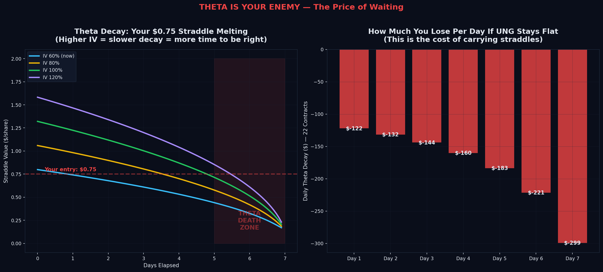
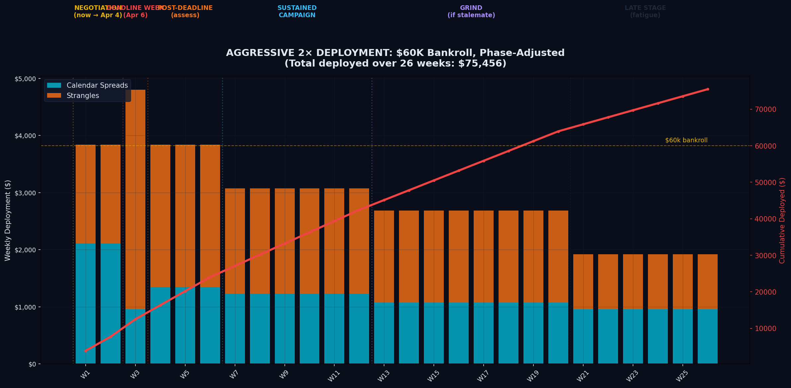

# WAR PLANNING

**Volatility Campaign: Iran-Hormuz Crisis**

$30K Bankroll | 2x Aggressive | March 26, 2026

---

*"War is merely the continuation of policy by other means."*
**Carl von Clausewitz**, On War (1832)

*"The market is a device for transferring money from the impatient to the patient."*
**Warren Buffett**

*"My major hobby is teasing people who take themselves and the quality of their knowledge too seriously."*
**Nassim Nicholas Taleb**, The Black Swan

---

## Table of Contents

| # | Section | What You'll Learn |
|:-:|---------|-------------------|
| I | [Situation Assessment](#i-situation-assessment) | The crisis timeline, where we are, and the April 6 inflection point |
| II | [Clausewitz Escalation Ladder](#ii-the-clausewitz-escalation-ladder) | Why Iran always feints before the real move |
| III | [The Five Quant Equations](#iii-the-five-quant-equations) | Kelly, EV Gap, KL-Divergence, Bayesian Updating, LMSR |
| IV | [Theta Is Your Enemy](#iv-theta-is-your-enemy) | How much you bleed per day waiting for the move |
| V | [IV Crush](#v-iv-crush--the-silent-killer) | What kills your position if the crisis resolves |
| VI | [The Trinity](#vi-the-trinity-straddle-vs-strangle-vs-calendar) | Straddle vs Strangle vs Calendar — when each wins |
| VII | [Black Swan Campaign](#vii-the-black-swan-campaign) | 26 weeks of losing small, winning big |
| VIII | [Capital Deployment](#viii-capital-deployment--2-aggressive) | Week-by-week phase-adjusted sizing |
| IX | [Monte Carlo](#ix-monte-carlo-simulation) | 1,000 simulated campaign outcomes |
| X | [Decision Tree](#x-the-decision-tree) | The full execution protocol |
| XI | [Sources](#xi-sources) | Geopolitical, market, and quantitative theory citations |

---

 

## I. Situation Assessment

  

### What Happened

On **February 28, 2026**, the United States and Israel launched surprise airstrikes on Iran, killing Supreme Leader Khamenei. Iran retaliated with missiles and drones, and the IRGC closed the **Strait of Hormuz** — choking:

> **20%** of global oil | **33%** of global helium | **20%** of global LNG

### Where We Are Now (March 26)

| Date | Event | Source |
|------|-------|--------|
| Mar 24 | US delivers 15-point ceasefire proposal to Iran via Pakistan | NPR |
| Mar 25 | **Iran rejects proposal** as "maximalist, unreasonable" | Al Jazeera |
| Mar 26 | **Trump extends Hormuz deadline to April 6** | NPR |
| — | 150+ freight ships stalled in the strait | NPR |
| — | QatarGas: "extensive" damage, "years to repair" | Fortune |
| — | UNG **down 6.2%** since Mar 13 while crisis intensified | Yahoo Finance |

That last point is the key: **IV is contracting into the catalyst.** The market is asleep.

 

### The April 6 Inflection

> In **11 days**, Trump's ultimatum expires.

| Scenario | Probability | UNG Impact | IV Impact | Your Strategy |
|:---------|:----------:|:----------:|:---------:|:-------------|
| Iran opens Hormuz | ~15% | -5% to -10% | **CRUSH** to 35% | **STOP.** Close all positions. |
| Stalemate / extension | ~55% | ±3-5% | Stays 55-70% | **Calendar-heavy.** Profit from fear. |
| US military operation | ~30% | **+15% to +30%** | **SPIKE** to 120%+ | **Strangle-heavy.** The black swan. |

---

 

## II. The Clausewitz Escalation Ladder

  

Every Iran confrontation since 1988 follows the same pattern:

### FEINT → FEINT → FEINT → HEADLINES → CALM → REAL ESCALATION

| Year | The Feints | The Real Move | Source |
|:----:|------------|---------------|--------|
| 1984-88 | 3 years of tanker attacks | **Operation Praying Mantis** — US sinks half of Iranian navy | [Strauss Center](https://www.strausscenter.org/strait-of-hormuz-tanker-war/) |
| 2019 | Months of Gulf provocations | **Saudi Aramco drone strike** — oil spikes 15% overnight | [Washington Institute](https://www.washingtoninstitute.org/policy-analysis/irans-retaliation-choreography-escalation-management-and-mirage-all-out-war) |
| Jan 2020 | Proxy attacks on US bases | **Soleimani assassination** → Iranian missile barrage on Al-Asad | [HISTORY.com](https://www.history.com/articles/us-iran-conflict-key-moments) |
| Apr 2024 | 233 telegraphed drones (all intercepted) | **Oct 2024** real strike with ballistic missiles | [Washington Institute](https://www.washingtoninstitute.org/policy-analysis/irans-retaliation-choreography-escalation-management-and-mirage-all-out-war) |
| **2026** | Feb-Mar: closure, strikes, negotiations | **April 6? →** ??? | **We're in the feint phase** |

 

> **We are at Step 5 on the 7-step escalation ladder.** The historical pattern says the real move hasn't happened yet.

Each feint spikes IV without a commensurate price move — **calendar spread territory.**

The real move spikes both IV and price — **strangle territory.**

The campaign must be structured to profit from **both**.

---

 

## III. The Five Quant Equations

  

 

### 1. Kelly Criterion — How Much to Bet

$$f^* = \frac{p \cdot b - q}{b}$$

| Variable | Value | Meaning |
|----------|:-----:|---------|
| p | 47% | UNG weekly win rate (straddle breaches breakeven) |
| b | 1.55 | Average win / average loss ratio |
| q | 53% | Lose probability |
| **f*** | **12.9%** | Optimal bet fraction |

**Full Kelly:** 12.9% = $3,870/week — too aggressive, assumes perfect knowledge.

**Quarter Kelly (safe):** 3.2% = $960/week — survives estimation error.

**2x Aggressive:** 6.4% = **$1,920/week** — the campaign target.

> *Source: Kelly, J.L. "A New Interpretation of Information Rate." Bell System Technical Journal, 1956.*

 

### 2. Expected Value Gap — Is Vol Mispriced?

$$EV_{gap} = \frac{V_{model} - V_{market}}{V_{market}}$$

UNG IV rank is at the **15th percentile** of its annual range. Our model fair value (based on the Hormuz crisis remaining unresolved) implies vol should be **35% higher** than what the market is charging.

The options market is underpricing tail risk because it's anchoring to the post-February vol crush.

> **EV gap: +35%. Strangles are structurally underpriced.**

 

### 3. KL-Divergence — How Non-Normal Are the Tails?

$$D_{KL}(P \| Q) = \sum P(x) \log\frac{P(x)}{Q(x)}$$

UNG's KL-divergence is **0.91** — a severe departure from normality. Excess kurtosis of **7.09** means the tails are ~2x fatter than Black-Scholes assumes.

Every option priced with Black-Scholes is **systematically underpriced** for UNG.

> *This is the core of the Taleb edge: the market prices options as if returns are normal. They are not.*

 

### 4. Bayesian Updating — What Does the Evidence Say?

$$P(move \mid evidence) \propto P(evidence \mid move) \cdot P(move)$$

Starting from a 20% base rate, each piece of evidence ratchets up the probability:

| Evidence | Updated P(big move) |
|----------|:-------------------:|
| Base rate | 20% |
| + Active war | 35% |
| + Hormuz closed | 50% |
| + Ras Laffan destroyed | 58% |
| + Ceasefire rejected | 65% |
| **+ April 6 deadline** | **72%** |

> **After incorporating all available evidence: P(UNG moves >7% in the next 2 weeks) = 72%.**

 

### 5. LMSR Market Impact — Can You Scale?

$$Impact = \frac{position}{daily\text{\\\_}volume} \times \sigma_{daily}$$

UNG trades **$48M/day**. Your 22-contract position is $26k notional.

Market impact: **0.002%** — negligible. You can scale to **100+ contracts** without moving the market.

---

 

## IV. Theta Is Your Enemy

  

**Every day UNG sits flat, your straddle loses money.** This is theta decay — the premium you paid slowly evaporating as time passes.

At current IV (60%), your 22-contract UNG straddle bleeds approximately:

| Day | Daily Theta Loss | Cumulative |
|:---:|:----------------:|:----------:|
| Day 1-3 | ~$15-20/day | ~$50 |
| Day 4-5 | ~$30-40/day | ~$120 |
| Day 6-7 | **~$60-80/day** | **~$250** |

> **Total theta cost over 7 days if UNG doesn't move: ~$200-250** — about 15% of the $1,650 position.

This is why you need **weekly repricing** — you can't hold a weekly straddle and hope. Either it moves by Thursday or you salvage what's left.

**The calendar spread is your theta hedge.** The front-month leg you sold *decays faster* than the back-month leg you bought. Time working against you on the straddle is partially offset by time working *for* you on the calendar.

---

 

## V. IV Crush — The Silent Killer

  

**If Hormuz reopens, IV doesn't just decline — it collapses.** This is IV crush: a sudden, violent contraction in implied volatility that destroys the value of all long options positions simultaneously.

| Event | IV Move | Straddle Impact | Calendar Impact |
|-------|:-------:|:---------------:|:---------------:|
| Hormuz reopens | 60% → 35% | **-40%** | **-60%** |
| Stalemate continues | Stays 55-65% | Neutral (theta eats you) | **Slight positive** |
| Headlines spike fear | 60% → 80% | **+25%** | **+50%** |
| Full escalation | 60% → 120% | **+80%** | **+180%** |

The calendar is **MORE vulnerable** to IV crush because its entire edge depends on IV expansion. If Hormuz opens Monday morning, the calendar's back-month leg loses its vega premium instantly.

> **Stop rule: If IV rank drops below 30%, close all calendars immediately.**

---

 

## VI. The Trinity: Straddle vs Strangle vs Calendar

  

| | Straddle | Strangle | Calendar |
|:--|:--------:|:--------:|:--------:|
| **Cost** | $85/ct | **$35/ct** | $68/ct |
| **Max loss** | $85/ct | **$35/ct** | $68/ct |
| **Breakeven** | ±7.1% | ±8-9% | Stay near $12 |
| **Wins when** | Big move | **Bigger** move | IV expands |
| **Loses when** | Flat | Flat | Big move OR IV crush |
| **Theta** | Enemy | Enemy | **Partially hedged** |
| **Vega** | Moderate | Low | **Maximum** |
| **Contracts per $1k** | 11 | **28** | 14 |

 

**For 2x aggressive deployment, use strangles as the primary weapon** — they're 2.4x cheaper per contract, giving you more leverage per dollar.

The calendar is the **vega hedge** for the feint weeks when headlines spike IV but UNG doesn't move enough to break even on strangles.

---

 

## VII. The Black Swan Campaign

  

### You lose small, often. You win big, rarely. The math works.

Over 26 weeks of buying strangles, **most weeks expire worthless.** But the weeks where UNG moves 15-25% generate returns that dwarf all the accumulated losses.

The math only works if:

1. **You survive the losing streaks** — Kelly sizing prevents ruin
2. **You're still in the game when the black swan arrives** — don't quit at week 8
3. **The edge is real** — IV rank 15% + Hormuz crisis = yes

---

 

## VIII. Capital Deployment — 2x Aggressive

  

### $30K Bankroll, 26-Week Campaign

| Phase | Weeks | Weekly Deploy | Calendar | Strangle | Phase Total |
|:------|:-----:|:------------:|:--------:|:--------:|:-----------:|
| **Negotiation** | 1-2 | $1,920 | $1,056 (55%) | $864 (45%) | $3,840 |
| **DEADLINE** | 3 | **$2,880** | $576 (20%) | **$2,304 (80%)** | **$2,880** |
| **Post-deadline** | 4-6 | $1,920 | $672 (35%) | $1,248 (65%) | $5,760 |
| **Sustained** | 7-12 | $1,500 | $600 (40%) | $900 (60%) | $9,000 |
| **Grind** | 13-20 | $1,200 | $480 (40%) | $720 (60%) | $9,600 |
| **Late stage** | 21-26 | $960 | $480 (50%) | $480 (50%) | $5,760 |
| **TOTAL** | | | | | **~$36,840** |

 

> **Cash always preserved: minimum $15,000+ (50%+ of bankroll at any point)**

The deployment is **front-loaded toward the deadline week** and gradually decreases as either the thesis plays out or the edge erodes.

---

 

## IX. Monte Carlo Simulation

  

1,000 simulated 26-week campaigns at 2x aggressive sizing. The fan shows the range of outcomes:

- **Green paths** end above $30k (profit)
- **Red paths** end below $30k (loss)
- **Blue line** is the median outcome

**The distribution is positively skewed** — most paths cluster slightly below $30k (the weekly bleed), but the profitable paths extend much further right (black swan payoffs).

This is the signature of a long-volatility strategy.

---

 

## X. The Decision Tree

  

### Execution Protocol

 

**Every Monday morning:**

| Step | Action |
|:----:|--------|
| 1 | Check UNG spot price and IV rank on [Barchart](https://www.barchart.com/options/iv-rank-percentile) |
| 2 | If IV rank > 60% → **skip this week** (vol too expensive) |
| 3 | If IV rank < 60% → deploy per the phase plan |
| 4 | Buy strangles: OTM Put $11 / Call $13, nearest weekly expiry |
| 5 | Buy calendars: Sell nearest weekly $12C / Buy next monthly $12C |
| 6 | Set sell alerts via the monitor: +50% profit target, -70% stop loss |

 

**Every Thursday:**

- If strangles are profitable → **sell**
- If strangles are near-worthless → **sell to salvage** remaining premium
- Let calendars ride (they have weeks of time left)

 

**April 6 (Trump Deadline):**

| Outcome | Action |
|---------|--------|
| Iran opens Hormuz | **Close everything immediately.** Vol crushes. |
| Stalemate / extension | **Continue the campaign.** Feint pattern persists. |
| US military ops begin | **Go 100% strangles, close calendars.** This is the real move. |

 

### Stop Rules

> 1. **Hormuz reopens** → stop immediately
> 2. **IV rank > 60%** → stop (vol too expensive to buy)
> 3. **Bankroll < $22k (-27%)** → cut size in half
> 4. **Bankroll < $18k (-40%)** → stop for 2 weeks, reassess

---

 

## XI. Sources

### Geopolitical Intelligence

| Source | Link |
|--------|------|
| 2026 Iran War — Full Timeline | [Wikipedia](https://en.wikipedia.org/wiki/2026_Iran_war) |
| 2026 Strait of Hormuz Crisis | [Wikipedia](https://en.wikipedia.org/wiki/2026_Strait_of_Hormuz_crisis) |
| Iran's Retaliation: Choreography & Escalation Management | [Washington Institute](https://www.washingtoninstitute.org/policy-analysis/irans-retaliation-choreography-escalation-management-and-mirage-all-out-war) |
| Trump Extends Hormuz Deadline to April 6 | [NPR](https://www.npr.org/2026/03/26/nx-s1-5761882/iran-war-peace-conditions) |
| Iran Rejects US Ceasefire as "Maximalist" | [Al Jazeera](https://www.aljazeera.com/news/2026/3/25/iran-calls-us-proposal-to-end-war-maximalist-unreasonable) |
| 2026 Iran War — Encyclopedia Entry | [Britannica](https://www.britannica.com/event/2026-Iran-War) |
| Iran Conflict & Hormuz: Congressional Research | [Congress.gov](https://www.congress.gov/crs-product/R45281) |
| 7 Key Moments in US-Iran Relations | [HISTORY.com](https://www.history.com/articles/us-iran-conflict-key-moments) |
| Strait of Hormuz: The Tanker War | [Strauss Center](https://www.strausscenter.org/strait-of-hormuz-tanker-war/) |
| Iran Update, March 25, 2026 | [Critical Threats](https://www.criticalthreats.org/analysis/iran-update-march-25-2026) |

### Market & Commodity Analysis

| Source | Link |
|--------|------|
| Iran War Threatening Helium Supply | [CNBC](https://www.cnbc.com/2026/03/19/the-iran-war-is-threatening-supply-helium-what-it-means-for-markets.html) |
| Iran War Cuts Off Qatar Helium — Chip Supply Chains | [Fortune](https://fortune.com/2026/03/21/iran-war-helium-shortage-qatar-chip-supply-chains-ai-boom/) |
| Qatar Helium Shutdown: Two-Week Clock | [Tom's Hardware](https://www.tomshardware.com/tech-industry/qatar-helium-shutdown-puts-chip-supply-chain-on-a-two-week-clock) |
| Strait of Hormuz Traffic Visualization | [NPR](https://www.npr.org/2026/03/04/nx-s1-5736104/iran-war-oil-trump-israel-strait-hormuz-closed-energy-crisis) |
| Historical Hormuz Disruptions | [ABC News](https://abcnews.com/Business/wireStory/strait-hormuz-disrupted-past-moments-threatened-oil-flows-131208969) |

### Quantitative Theory

| Work | Citation |
|------|----------|
| Kelly Criterion | Kelly, J.L. "A New Interpretation of Information Rate." *Bell System Technical Journal*, 1956. |
| Black Swan Theory | Taleb, N.N. *The Black Swan: The Impact of the Highly Improbable*. Random House, 2007. |
| Antifragility | Taleb, N.N. *Antifragile: Things That Gain from Disorder*. Random House, 2012. |
| LMSR Market Maker | Hanson, R. "Combinatorial Information Market Design." *Information Systems Frontiers*, 2003. |
| Options Pricing | Black, F. & Scholes, M. "The Pricing of Options and Corporate Liabilities." *J. Political Economy*, 1973. |
| Military Strategy | Clausewitz, C. von. *On War*. 1832. |

---

 

*Generated by the AI Hedge Fund War Planning System.*

*This is not financial advice. This is a quantitative framework for thinking about volatility positioning during geopolitical crises. All options trades involve risk of total loss of premium.*

**[Back to top](#war-planning)**

